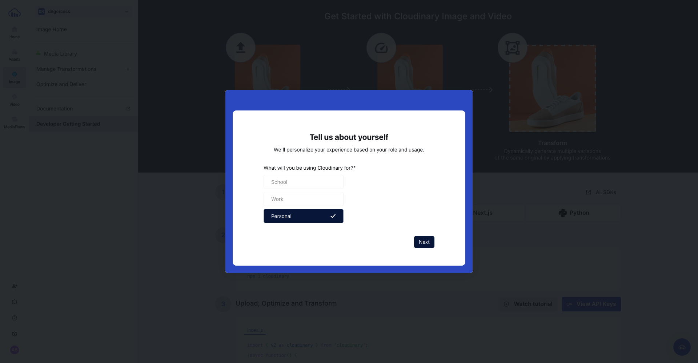
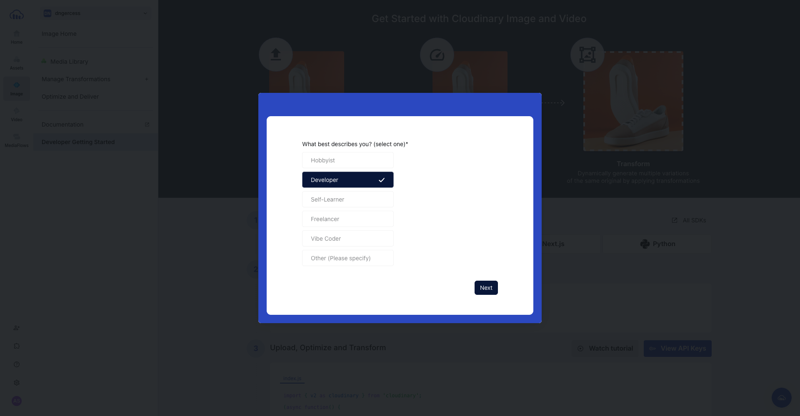
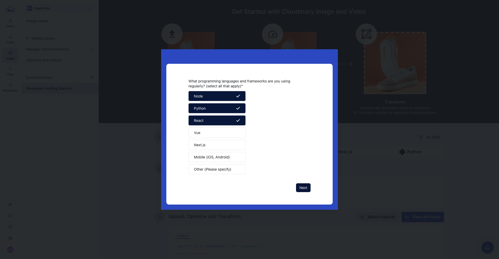
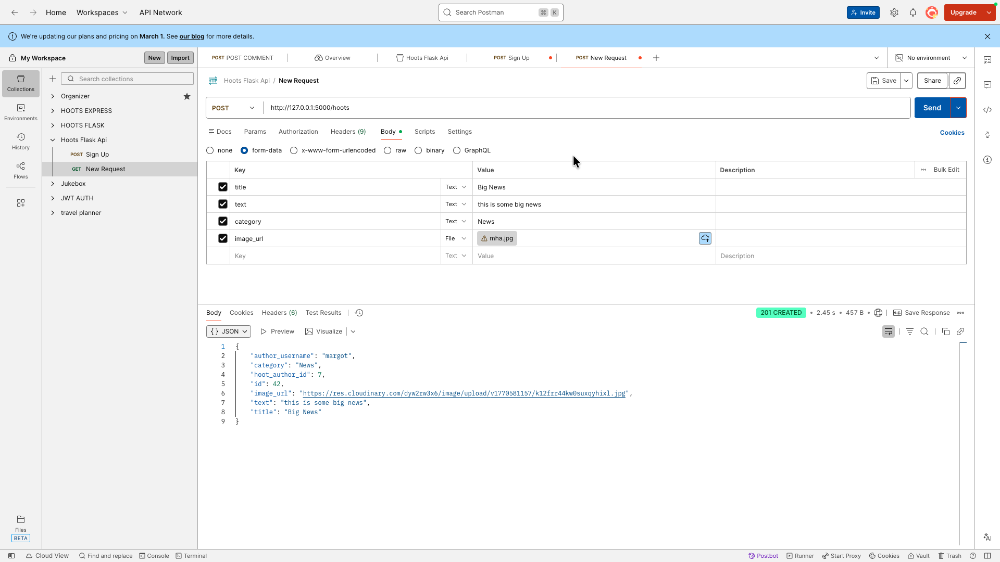
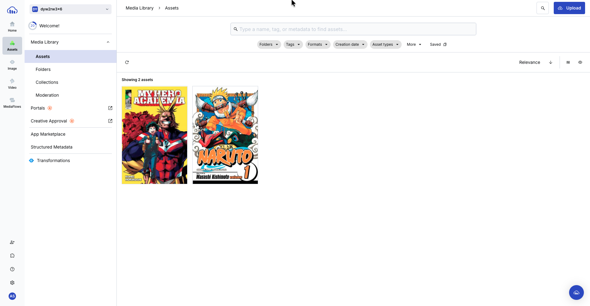

# Uploading Images in Flask Using Cloudinary

## Getting Started with Cloudinary

1. Sign up for a free [Cloudinary account](https://cloudinary.com/).


2. Answer a series of questions (they may be different than what is shown below):

<div style="display: flex; overflow-x: auto; gap: 12px; padding: 8px 0;">
    
    
    
    
    
</div>

## Setting Up Your Flask Code
> This section assumes you already have a Flask application started and want to add image uploads to an existing SQL table.

1. Open your Flask project and start the virtual environment: `pipenv shell`
2. Install cloudinary: `pipenv install cloudinary`
    > ⚠️ Note: The cloudinary website says to use `pip3 install cloudinary` but this will cause issues with deploy
3. Let's create 3 environment variables in our `.env` file so we don't push sensitive information to GitHub. When you click the blue` View API Keys` button, you will get access to the following information:
```
CLOUD_NAME=your_cloud_name
API_KEY=your_api_key
API_SECRET=your_api_>secret
```
4. Create a `main.py` file and add the following code:
```py
# main.py

import os
import cloudinary
import cloudinary.uploader
from cloudinary.utils import cloudinary_url

# Configuration
cloudinary.config(
    cloud_name=os.getenv('CLOUD_NAME'),
    api_key=os.getenv('API_KEY'),
    api_secret=os.getenv('API_SECRET'),
    secure=True
)

# Image upload
def upload_image(file):
    result = cloudinary.uploader.upload(file)
    return result["secure_url"]
```

5. Now we need to import this file into `hoots_blueprint.py`

```py
# hoots_blueprint.py

from main import upload_image # <-- New line of code to add to the bottom of all other imports
```

## Updating the `flask_hoot` Database
Next, we need to make sure our hoots table has an `image_url` column.
1. In the terminal enter the psql shell: `psql`
2. Then connect to your database: `\c flask_hoot` <- make sure you know your actual database name
3. Then update the hoots table:
```psql
ALTER TABLE hoots
ADD COLUMN image_url TEXT DEFAULT NULL;
```

**If you're creating a database from scratch, then you might do something like this in your terminal:**
```sql
psql
```
```sql
CREATE DATABASE flask_hoot;
```
```sql
CREATE TABLE users (
    id SERIAL PRIMARY KEY,
    username VARCHAR(50) NOT NULL,
    password VARCHAR(255) NOT NULL
);
```
```sql
CREATE TABLE hoots (
    id SERIAL PRIMARY KEY,
    author INTEGER REFERENCES users(id) ON DELETE CASCADE,
    title VARCHAR(255),
    text VARCHAR(280),
    category VARCHAR(50),
    image_url TEXT DEFAULT NULL
);
```

## Updating the `create_hoot` route
> Let's modify the `create_hoot` function so that it can accept any type of form information (json AND image files)
```py
#hoots_blueprint.py

@hoots_blueprint.route('/hoots', methods=['POST'])
@token_required
def create_hoot():
    try:
        image = request.files.get("image_url")
        # image_url refers to the column name on the hoots table
        # if the user does not upload an image it will default to None
        image_url = None
        # if the user does upload an image, then we update our image_url field to the uploaded image
        if image:
            image_url = upload_image(image)

        # set the author_id to be the id of the currently logged in user
        author_id = g.user["id"]

        # specify the rest of the fields in our table and grab that information
        title = request.form.get("title")
        text = request.form.get("text")
        category = request.form.get("category")

        # connect to the database
        connection = get_db_connection()
        cursor = connection.cursor(
            cursor_factory=psycopg2.extras.RealDictCursor)

        # insert all the form data into the database
        cursor.execute("""
                        INSERT INTO hoots (author, title, text, category, image_url)
                        VALUES (%s, %s, %s, %s, %s)
                        RETURNING id
                        """,
                       (author_id, title, text, category, image_url)
                       )
        hoot_id = cursor.fetchone()["id"]

        # Join the user table and the hoots table
        # Show the newly created information along with the user information
        cursor.execute("""SELECT h.id, 
                            h.author AS hoot_author_id, 
                            h.title, 
                            h.text, 
                            h.category, 
                            h.image_url,
                            u_hoot.username AS author_username
                        FROM hoots h
                        JOIN users u_hoot ON h.author = u_hoot.id
                        WHERE h.id = %s
                       """, (hoot_id,))
        created_hoot = cursor.fetchone()
        connection.commit()
        connection.close()

        # Return the newly created information
        return jsonify(created_hoot), 201
    except Exception as error:
        return jsonify({"error": str(error)}), 500
```
## Updating the `update_hoot` route
> Finally, let's modify out `update_hoot` route so we can change the image if we want. This code will be very similar to the `create_hoot` code

```py
#hoots_blueprint.py

@hoots_blueprint.route('/hoots/<hoot_id>', methods=['PUT'])
@token_required
def update_hoot(hoot_id):
    try:
        image = request.files.get("image_url")
        # image_url refers to the column name on the hoots table
        # if the user does not upload an image it will default to None
        image_url = None
        # if the user does upload an image, then we update our image_url field to the uploaded image
        if image:
            image_url = upload_image(image)
            
        # specify the rest of the fields in our table and grab that information
        title = request.form.get("title")
        text = request.form.get("text")
        category = request.form.get("category")
        
        # connect to the database
        connection = get_db_connection()
        cursor = connection.cursor(
            cursor_factory=psycopg2.extras.RealDictCursor)
        cursor.execute("SELECT * FROM hoots WHERE hoots.id = %s", (hoot_id,))
        hoot_to_update = cursor.fetchone()
        if hoot_to_update is None:
            return jsonify({"error": "hoot not found"}), 404
        connection.commit()
        if hoot_to_update["author"] is not g.user["id"]:
            return jsonify({"error": "Unauthorized"}), 401

        final_image_url = image_url if image_url else hoot_to_update.get(
            "image_url")

         # update all the form data in the database
        cursor.execute("UPDATE hoots SET title = %s, text = %s, category = %s, image_url = %s WHERE hoots.id = %s RETURNING *",
                       (title, text, category, final_image_url, hoot_id))
        hoot_id = cursor.fetchone()["id"]

        # Join the user table and the hoots table
        # Show the newly created information along with the user information
        cursor.execute("""SELECT h.id, 
                            h.author AS hoot_author_id, 
                            h.title, 
                            h.text, 
                            h.category, 
                            h.image_url,
                            u_hoot.username AS author_username
                        FROM hoots h
                        JOIN users u_hoot ON h.author = u_hoot.id
                        WHERE h.id = %s
                       """, (hoot_id,))
        updated_hoot = cursor.fetchone()
        connection.commit()
        connection.close()
        return jsonify(updated_hoot), 200
    except Exception as error:
        return jsonify({"error": str(error)}), 500
```

## Testing it out in Postman

> You can test this out in postman! If everything has been setup correctly, we should be able to upload an image to a new hoot and see the image in our Cloudinary dashboard.

1. Make a collection in Postman for your Hoots, then create an account in your database. You'll want to make sure to use the generated token to authenticate your requests. If you need help with this step, view the steps in detail [here](./Postman-Help.md)

2. Create a POST request for hoots in your collection and use this url: `http://127.0.0.1:5000/hoots`
    > make sure to change 5000 to the actual port number you're using
3. Select `Body` then `form-data`
4. Add a new key for each column in your hoots table except for author.
5. Make sure all the keys except for `image_url` say `Text` next to them. Select `File` for the `image_url`.
6. Fill out all the values with information and for the `image_url` select any image from your computer by clicking on `Select files`

7. When you click `send` you should get a response that looks similar to this:
```json
{
    "author_username": "margot",
    "category": "News",
    "hoot_author_id": 7,
    "id": 42,
    "image_url": "https://res.cloudinary.com/dyw2rw3x6/image/upload/v1770581157/k12frr44kw0suxqyhixl.jpg",
    "text": "this is some big news",
    "title": "Big News"
}
```
> Notice how the image_url has a cloudinary url
8. Now lets check our **Cloudinary dashboard** and see if the image is there:
- Select `Assets > Media Library > Assets` and you should see your photo


**You are now done setting up image uploads in your Flask Backend! 🎉**