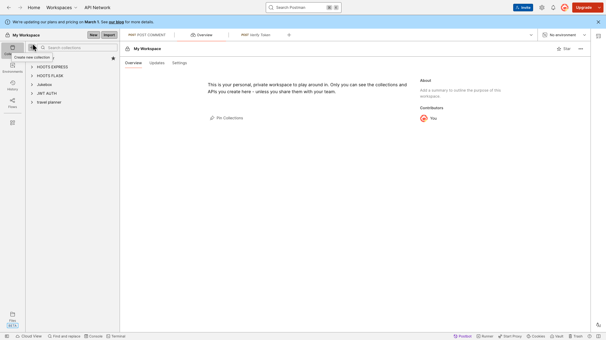
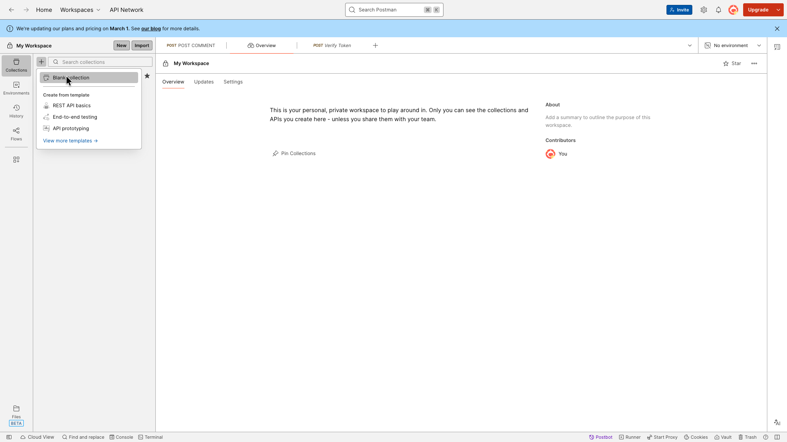
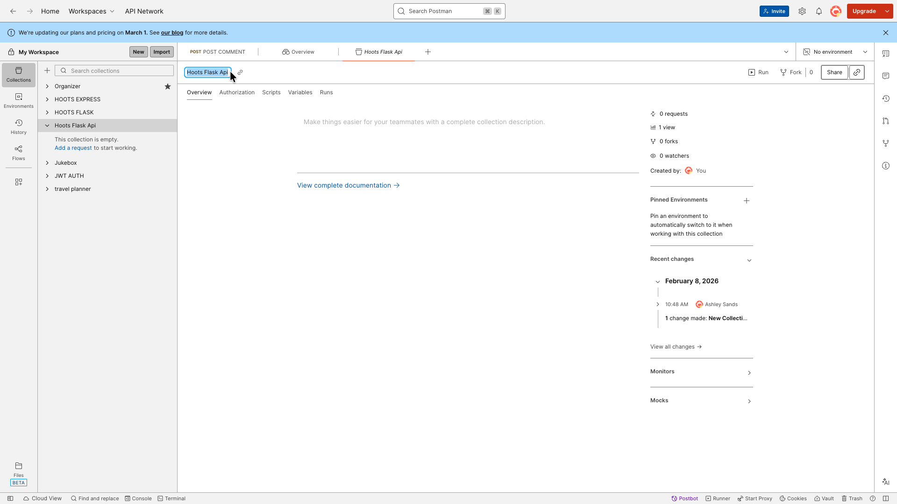
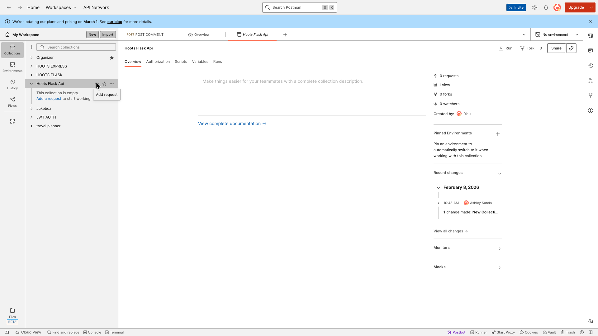
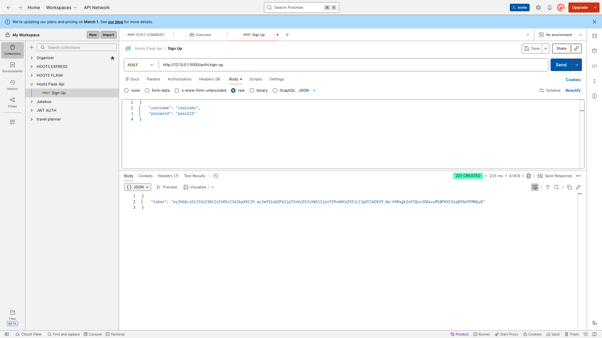
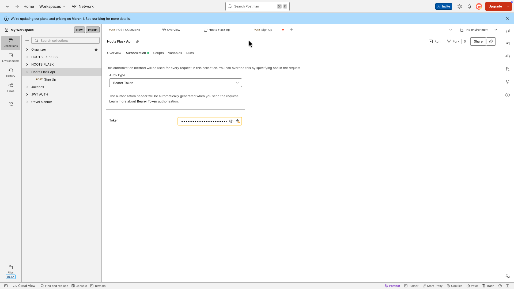

# Postman Help
## About 
These instructions will show how to setup Postman

## Content
- [Create a Collection](#create-a-collection)
- [Sign Up a New User](#sign-up-a-new-user)
- [Authorize All Routes](#authorize-all-routes)

## Create a Collection
Create a new collection and select blank collection. Name your collection **Hoots Flask Api**.
<div style="display: flex; overflow-x: auto; gap: 12px; padding: 8px 0;">
    
    
    
</div>

## Sign Up a New User
Create a POST request to sign up a new user
> Note: Make sure your backend is running

Make sure you have everything setup correctly:
1. Select `POST`
2. The url should be: http://127.0.0.1:5000/auth/sign-up
3. Select `Body`, `raw` and `JSON`
4. Add in a username and password:
```json
{
    "username": "cooluser",
    "password": "pass123"
}
```

<div style="display: flex; overflow-x: auto; gap: 12px; padding: 8px 0;">
    
    
</div>

## Authorize All Routes
After hitting send, you should see a token. 
1. Copy the token (just the part in between the quotes)
2. Click on the name of your collection on the left: **Hoot Flask Api**
3. Click the Authorization tab
4. Select Bearer Token as the Auth Type
5. Paste in your token



**You are now setup with Postman! 🎉**

Get started adding Cloudinary image uploads here: [Flask Instructions](./Flask-Image-Upload-Instructions.md)