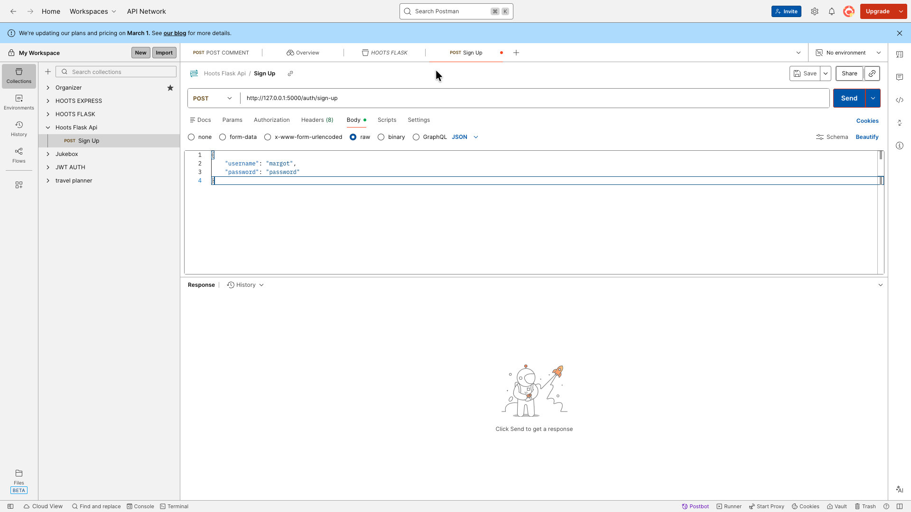

1. Create a new collection and select blank collection. Then name your collection Hoots Flask Api:
<div style="display: flex; overflow-x: auto; gap: 12px; padding: 8px 0;">
    
    
    
</div>

2. Create a POST request to sign up a new user
> Note: Make sure your backend is running

<div style="display: flex; overflow-x: auto; gap: 12px; padding: 8px 0;">
    
    
</div>

Make sure you have everything setup correctly:
1. Select `POST`
2. The url should be: http://127.0.0.1:5000/auth/sign-up
3. Select `Body`, `raw` and `JSON` (this can be selected as the last option below `Body` after selecting `raw`)
4. Add in a username and password:
```json
{
    "username": "margot",
    "password": "password"
}
```

3. After hitting send, you should see a token. 
- Copy the token (just the part in between the quotes)
- Click on the name of your collection on the left: Hoot Flask Api
- Click the Authorization tab
- Select Bearer Token as the Auth Type
- Paste in your token

